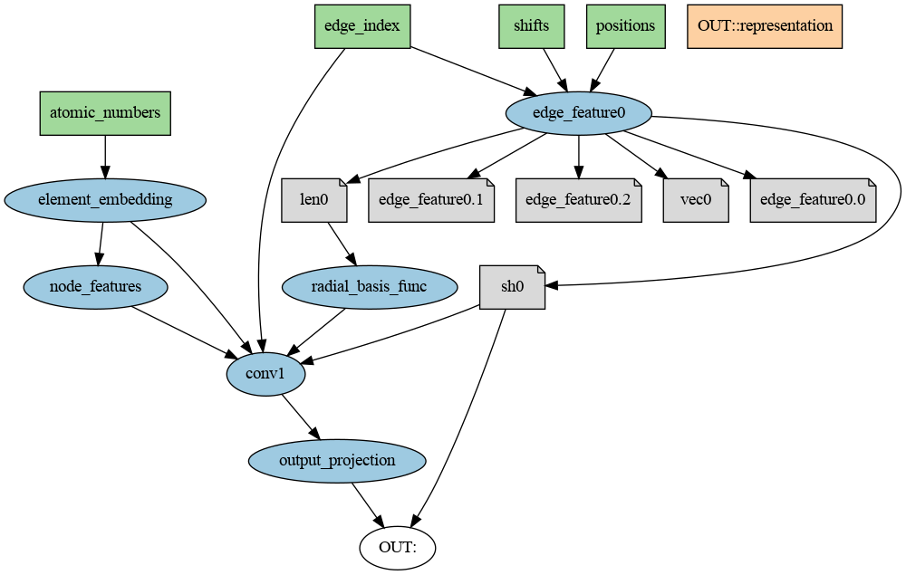

<p align="center">
  
</p>

---

# **KLay** — *Composable layers for KLIFF & MLIPs*
[](https://pypi.org/project/klay)
[](https://klay.readthedocs.io/en/latest)

> **KLay** takes the “LEGO-block” approach to machine-learning interatomic
> potentials *(MLIPs)*: every layer is a first-class citizen you can swap,
> re-wire and re-train — no copy-pasting opaque model code.

* Works out-of-the-box with **[KLIFF](https://github.com/openkim/kliff)**
* Converts a single YAML file → **`torch.fx.GraphModule`** (ready for
  `torch.compile`, TorchScript, ONNX...)
* Or: returns a **dict of instantiated layers** when you just want the bricks
* Built-in `validate`, `visualize`, `export`, `layers` & `types`
  CLI commands
* Ships NequIP blocks today; MACE, EGNN & M3GNet on the roadmap

---

## Installation

```bash
pip install klay
# or: dev version
pip install git+https://github.com/openkim/klay.git
```

## Usage in Python

```python
from klay.io import load_config
from klay.builder import build_model

cfg   = load_config("example/new_model.yaml")
model = build_model(cfg)   # GraphModule (because cfg has inputs/outputs)
```

## Need only the bricks?

```python
from klay.builder import build_layers
from klay.io import load_config
layers = build_layers(load_config("example/new_model_layers.yaml"))
print(layers.keys())               # dict_keys([...])
```

# Command-line utilities
| Command            | What it does                                                                                                                                    | Most common flags                           |
|--------------------|--------------------------------------------------------------------------------------------------------------------------------------------------|---------------------------------------------|
| `klay layers`      | Pretty table of every registered layer, showing inputs / outputs and `from_config` signature with coloured required/optional args.              | `--type embedding --all`                    |
| `klay types`       | Lists all `ModuleCategory` values (convolution, embedding, …).                                                                                   | —                                           |
| `klay validate`    | Cycle detection, missing sources, dangling layers, alias→alias detection, unused outputs plus optional Graphviz diagram.                         | `--allow-dangling -v/--visualize --fmt svg` |
| `klay export`      | Builds a full model, TorchScripts it (`.pt`) or dumps the `state_dict` (`.pth`).                                                                 | `-o out.pt --format state_dict -n 10`       |

Examples:

```shell
# 1. Inspect all embedding layers
klay layers --type embedding
```
result:
```
┏━━━━━━━━━━━━━━━━━━━━━━━━━━━━━━━━━┳━━━━━━━━━━━━━━━━━━━━━━━━┳━━━━━━━━━━━━━━━━━━━━━━┳━━━━━━━━━━━━━━━━━━━━━━━┓
┃ Layer                           ┃ Inputs                 ┃ Outputs              ┃ from_config args      ┃
┡━━━━━━━━━━━━━━━━━━━━━━━━━━━━━━━━━╇━━━━━━━━━━━━━━━━━━━━━━━━╇━━━━━━━━━━━━━━━━━━━━━━╇━━━━━━━━━━━━━━━━━━━━━━━┩
│ BesselBasis                     │ x                      │ y                    │ r_max,                │
│                                 │                        │                      │ num_radial_basis=8,   │
│                                 │                        │                      │ trainable=True        │
├─────────────────────────────────┼────────────────────────┼──────────────────────┼───────────────────────┤
│ BinaryAtomicNumberEncoding      │ x                      │ representation       │ -                     │
├─────────────────────────────────┼────────────────────────┼──────────────────────┼───────────────────────┤
│ ElectronicConfigurationEncoding │ x                      │ representation       │ -                     │
├─────────────────────────────────┼────────────────────────┼──────────────────────┼───────────────────────┤
│ OneHotAtomEncoding              │ x                      │ representation       │ num_elems,            │
│                                 │                        │                      │ input_is_atomic_numb… │
├─────────────────────────────────┼────────────────────────┼──────────────────────┼───────────────────────┤
│ PolynomialCutoff                │ x                      │ y                    │ r_max,                │
│                                 │                        │                      │ polynomial_degree=6   │
├─────────────────────────────────┼────────────────────────┼──────────────────────┼───────────────────────┤
│ RadialBasisEdgeEncoding         │ edge_length            │ edge_length_embedded │ r_max,                │
│                                 │                        │                      │ num_radial_basis=8,   │
│                                 │                        │                      │ polynomial_degree=6,  │
│                                 │                        │                      │ radial_basis_trainab… │
│                                 │                        │                      │ basis='BesselBasis',  │
│                                 │                        │                      │ cutoff='PolynomialCu… │
│                                 │                        │                      │ basis_kwargs={},      │
│                                 │                        │                      │ cutoff_kwargs={}      │
├─────────────────────────────────┼────────────────────────┼──────────────────────┼───────────────────────┤
│ SphericalHarmonicEdgeAttrs      │ pos, edge_index, shift │ 0: edge_vec          │ lmax=1,               │
│                                 │                        │ 1: edge_length       │ normalization='compo… │
│                                 │                        │ 2: edge_sh           │                       │
└─────────────────────────────────┴────────────────────────┴──────────────────────┴───────────────────────┘
```

```shell

# 2. Strict validation + PNG diagram
klay validate example/new_model.yaml -v
```

result:


Other Examples:
```shell
# 3. Script & save the model
klay export example/new_model.yaml
```

## YAML cheat-sheet
```yaml
model_params:
  r_max:      4.0
  n_channels: 32
  num_elems:  2

model_inputs:                      # (omit for "library mode")
  atomic_numbers: "Tensor (N,)"
  positions:      "Tensor (N,3)"
  edge_index:     "Tensor (2,E)"
  shifts:         "Tensor (E,3)"

model_layers:
  element_embedding:
    type: OneHotAtomEncoding
    config: {num_elems: ${model_params.num_elems}}

  edge_feature0:
    type: SphericalHarmonicEdgeAttrs
    config: {lmax: 1}
    output:
      0: vec0
      1: len0
      2: sh0

  radial_basis_func:
    type: RadialBasisEdgeEncoding
    config: {r_max: ${model_params.r_max}}
    inputs: {edge_length: len0}

  node_features:
    type: AtomwiseLinear
    config:
      irreps_in_block:  [{l:0, mul:${model_params.num_elems}}]
      irreps_out_block: [{l:0, mul:${model_params.n_channels}}]

  conv_shared:
    type: ConvNetLayer
    config:
      hidden_irreps_lmax: 1
      edge_sh_lmax:       1
      conv_feature_size:  ${model_params.n_channels}

  conv1:
    alias: conv_shared
    inputs:
      h:        node_features
      edge_sh:  sh0
      edge_length_embeddings: radial_basis_func

  output_projection:
    type: AtomwiseLinear
    config:
      irreps_in_block:
        - {l:0, mul:${model_params.n_channels}}
        - {l:1, mul:${model_params.n_channels}}
      irreps_out_block:
        - {l:0, mul:1}

model_outputs:
  energy:          output_projection
  representation:  conv1.h
```

# Roadmap
 - [ ] EGNN & SEGNN blocks
 - [ ] Pre-trained M3GNet & GemNet-T embeddings
 - [ ] ONNX export & torch.export backend
 - [ ] cuEquivariance/OpenEquivariance backend for the layers

Pull requests welcome.
